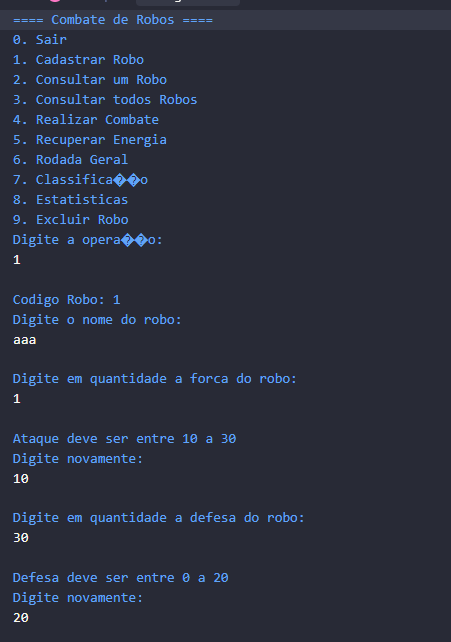
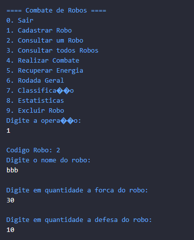
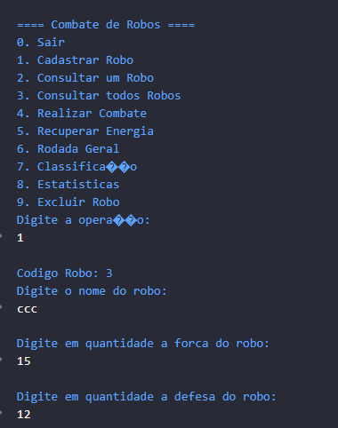
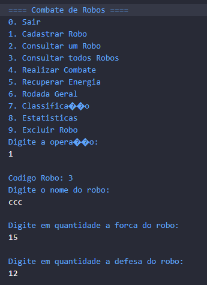
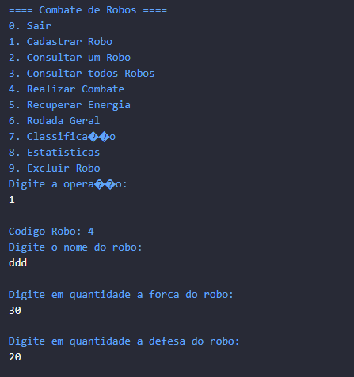
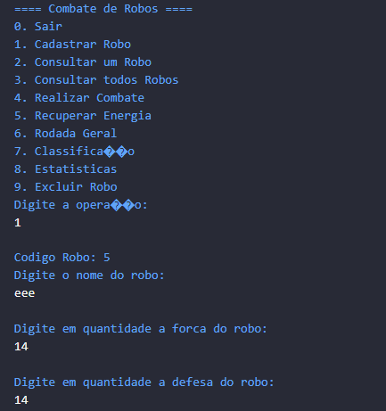
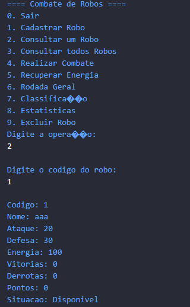

# ExerciciosJava

==== Combate de Robos ====
0. Sair
1. Cadastrar Robo
2. Consultar um Robo
3. Consultar todos Robos
4. Realizar Combate
5. Recuperar Energia
6. Rodada Geral
7. Classifica��o
8. Estatisticas
9. Excluir Robo
Digite a opera��o: 
1
Codigo Robo: 1
Digite o nome do robo: 
aaa
Digite em quantidade a forca do robo: 
0
Ataque deve ser entre 10 a 30
Digite novamente: 
11
Digite em quantidade a defesa do robo: 
30
Defesa deve ser entre 0 a 20
Digite novamente: 
20
==== Combate de Robos ====
0. Sair
1. Cadastrar Robo
2. Consultar um Robo
3. Consultar todos Robos
4. Realizar Combate
5. Recuperar Energia
6. Rodada Geral
7. Classifica��o
8. Estatisticas
9. Excluir Robo
Digite a opera��o: 
1
Codigo Robo: 2
Digite o nome do robo: 
bbb
Digite em quantidade a forca do robo: 
20
Digite em quantidade a defesa do robo: 
28
Defesa deve ser entre 0 a 20
Digite novamente: 
10
==== Combate de Robos ====
0. Sair
1. Cadastrar Robo
2. Consultar um Robo
3. Consultar todos Robos
4. Realizar Combate
5. Recuperar Energia
6. Rodada Geral
7. Classifica��o
8. Estatisticas
9. Excluir Robo
Digite a opera��o: 
1
Codigo Robo: 3
Digite o nome do robo: 
ccc
Digite em quantidade a forca do robo: 
12
Digite em quantidade a defesa do robo: 
5
==== Combate de Robos ====
0. Sair
1. Cadastrar Robo
2. Consultar um Robo
3. Consultar todos Robos
4. Realizar Combate
5. Recuperar Energia
6. Rodada Geral
7. Classifica��o
8. Estatisticas
9. Excluir Robo
Digite a opera��o: 
1
Codigo Robo: 4
Digite o nome do robo: 
ddd
Digite em quantidade a forca do robo: 
25
Digite em quantidade a defesa do robo: 
18
==== Combate de Robos ====
0. Sair
1. Cadastrar Robo
2. Consultar um Robo
3. Consultar todos Robos
4. Realizar Combate
5. Recuperar Energia
6. Rodada Geral
7. Classifica��o
8. Estatisticas
9. Excluir Robo
Digite a opera��o: 
1
Codigo Robo: 5
Digite o nome do robo: 
eee
Digite em quantidade a forca do robo: 
26
Digite em quantidade a defesa do robo: 
14
==== Combate de Robos ====
0. Sair
1. Cadastrar Robo
2. Consultar um Robo
3. Consultar todos Robos
4. Realizar Combate
5. Recuperar Energia
6. Rodada Geral
7. Classifica��o
8. Estatisticas
9. Excluir Robo
Digite a opera��o: 
2
Digite o codigo do robo: 
2
Codigo: 2
Nome: bbb
Ataque: 20
Defesa: 10
Energia: 100
Vitorias: 0
Derrotas: 0
Pontos: 0
Situacao: Disponivel
==== Combate de Robos ====
0. Sair
1. Cadastrar Robo
2. Consultar um Robo
3. Consultar todos Robos
4. Realizar Combate
5. Recuperar Energia
6. Rodada Geral
7. Classifica��o
8. Estatisticas
9. Excluir Robo
Digite a opera��o: 
3
Codigo: 1
Nome: aaa
Ataque: 11
Defesa: 20
Energia: 100
Vitorias: 0
Derrotas: 0
Pontos: 0
Codigo: 2
Nome: bbb
Ataque: 20
Defesa: 10
Energia: 100
Vitorias: 0
Derrotas: 0
Pontos: 0
Codigo: 3
Nome: ccc
Ataque: 12
Defesa: 5
Energia: 100
Vitorias: 0
Derrotas: 0
Pontos: 0
Codigo: 4
Nome: ddd
Ataque: 25
Defesa: 18
Energia: 100
Vitorias: 0
Derrotas: 0
Pontos: 0
Codigo: 5
Nome: eee
Ataque: 26
Defesa: 14
Energia: 100
Vitorias: 0
Derrotas: 0
Pontos: 0
==== Combate de Robos ====
0. Sair
1. Cadastrar Robo
2. Consultar um Robo
3. Consultar todos Robos
4. Realizar Combate
5. Recuperar Energia
6. Rodada Geral
7. Classifica��o
8. Estatisticas
9. Excluir Robo
Digite a opera��o: 
4
Digite o codigo do primeiro robo: 
1
Digite o codigo do segundo robo: 
2
Rodada: 1
aaa atacou o advers�rio
Dano causado: 5
Energia de bbb: 95
bbb contra-atacou
Dano causado: 5
Energia de aaa: 95
Rodada: 2
aaa atacou o advers�rio
Dano causado: 10
Energia de bbb: 85
bbb contra-atacou
Dano causado: 10
Energia de aaa: 85
Rodada: 3
aaa atacou o advers�rio
Dano causado: 5
Energia de bbb: 80
bbb contra-atacou
Dano causado: 5
Energia de aaa: 80
Rodada: 4
aaa atacou o advers�rio
Dano causado: 10
Energia de bbb: 70
bbb contra-atacou
Dano causado: 10
Energia de aaa: 70
Rodada: 5
aaa atacou o advers�rio
Dano causado: 5
Energia de bbb: 65
bbb contra-atacou
Dano causado: 5
Energia de aaa: 65
Empate
==== Combate de Robos ====
0. Sair
1. Cadastrar Robo
2. Consultar um Robo
3. Consultar todos Robos
4. Realizar Combate
5. Recuperar Energia
6. Rodada Geral
7. Classifica��o
8. Estatisticas
9. Excluir Robo
Digite a opera��o: 
5
Digite o c�digo do robo: 
1
Digite a quantidade de energia que deseja recuperar: 
100
A energia n�o pode passar de 100
==== Combate de Robos ====
0. Sair
1. Cadastrar Robo
2. Consultar um Robo
3. Consultar todos Robos
4. Realizar Combate
5. Recuperar Energia
6. Rodada Geral
7. Classifica��o
8. Estatisticas
9. Excluir Robo
Digite a opera��o: 
30
==== Combate de Robos ====
0. Sair
1. Cadastrar Robo
2. Consultar um Robo
3. Consultar todos Robos
4. Realizar Combate
5. Recuperar Energia
6. Rodada Geral
7. Classifica��o
8. Estatisticas
9. Excluir Robo
Digite a opera��o: 
5
Digite o c�digo do robo: 
1
Digite a quantidade de energia que deseja recuperar: 
30
O robo n�o possui pontos suficientes
==== Combate de Robos ====
0. Sair
1. Cadastrar Robo
2. Consultar um Robo
3. Consultar todos Robos
4. Realizar Combate
5. Recuperar Energia
6. Rodada Geral
7. Classifica��o
8. Estatisticas
9. Excluir Robo
Digite a opera��o: 
5
Digite o c�digo do robo: 
1
Digite a quantidade de energia que deseja recuperar: 
10
Energia recuperada com sucesso!
Energia atual: 75
Pontos restantes: 0
==== Combate de Robos ====
0. Sair
1. Cadastrar Robo
2. Consultar um Robo
3. Consultar todos Robos
4. Realizar Combate
5. Recuperar Energia
6. Rodada Geral
7. Classifica��o
8. Estatisticas
9. Excluir Robo
Digite a opera��o: 
6
Rodada Geral:
Confrontos: 
bbb versus ccc
ddd versus eee
Robo de folga: aaa
Iniciando os combates...

Combate: bbb x ccc
Rodada: 1
ccc atacou o advers�rio
Dano causado: 5
Energia de bbb: 60
bbb contra-atacou
Dano causado: 15
Energia de ccc: 85
Rodada: 2
ccc atacou o advers�rio
Dano causado: 10
Energia de bbb: 50
bbb contra-atacou
Dano causado: 20
Energia de ccc: 65
Rodada: 3
ccc atacou o advers�rio
Dano causado: 5
Energia de bbb: 45
bbb contra-atacou
Dano causado: 15
Energia de ccc: 50
Rodada: 4
ccc atacou o advers�rio
Dano causado: 10
Energia de bbb: 35
bbb contra-atacou
Dano causado: 20
Energia de ccc: 30
Rodada: 5
ccc atacou o advers�rio
Dano causado: 5
Energia de bbb: 30
bbb contra-atacou
Dano causado: 15
Energia de ccc: 15
Empate

Combate: ddd x eee
Rodada: 1
ddd atacou o advers�rio
Dano causado: 11
Energia de eee: 89
eee contra-atacou
Dano causado: 8
Energia de ddd: 92
Rodada: 2
ddd atacou o advers�rio
Dano causado: 16
Energia de eee: 73
eee contra-atacou
Dano causado: 13
Energia de ddd: 79
Rodada: 3
ddd atacou o advers�rio
Dano causado: 11
Energia de eee: 62
eee contra-atacou
Dano causado: 8
Energia de ddd: 71
Rodada: 4
ddd atacou o advers�rio
Dano causado: 16
Energia de eee: 46
eee contra-atacou
Dano causado: 13
Energia de ddd: 58
Rodada: 5
ddd atacou o advers�rio
Dano causado: 11
Energia de eee: 35
eee contra-atacou
Dano causado: 8
Energia de ddd: 50
Empate
==== Combate de Robos ====
0. Sair
1. Cadastrar Robo
2. Consultar um Robo
3. Consultar todos Robos
4. Realizar Combate
5. Recuperar Energia
6. Rodada Geral
7. Classifica��o
8. Estatisticas
9. Excluir Robo
Digite a opera��o: 
0
Saindo...